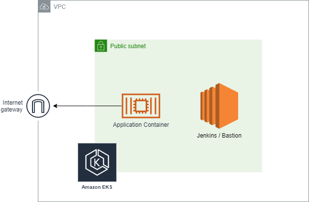

# CapstoneDevOpsProject

This project deploys a simple node server into a Kubernetes cluster using the AWS infrastructure. It also uses a CI/CD pipeline to enhance development and continous delivery of features.

## Architecture

The underlying architecture of the project is represented by the following diagram:



## Installation

To setup the project you need to first deploy the underlying infrastructure required to support the application. This is done by executing the following script:

### Windows

```shell
$ ./cloudformation/create_environment.bat
```

### Linux

```shell
$ ./cloudformation/create_environment.sh
```

Once the infrastructure is deployed, you need to install <a href="https://kubernetes.io/docs/tasks/tools/install-kubectl/">kubectl</a> and deploy the application using the following commands:

```shell
$ cd capstone_app
# configure kubectl
$ aws eks update-kubeconfig --name capstone-cluster

# deploy the service
$ kubectl create -f ./deployment.yml
$ kubectl create -f ./service.yml
```

### Cleanup

To make cleanup of the application and infrastructure you need to run first:

```shell
$ cd capstone_app
$ kubectl delete -f ./deployment.yml
$ kubectl delete svc node
```

Then you need to delete the infrastructure using the following command:

#### Windows

```shell
$ ./cloudformation/delete_environment.bat
```

#### Linux

```shell
$ ./cloudformation/delete_environment.sh
```

## Jenkins

First, you need to login with the Jenkins default password. Then go to settings > manage plugins and install the following plugins:

- Blue Ocean
- AWS Steps
